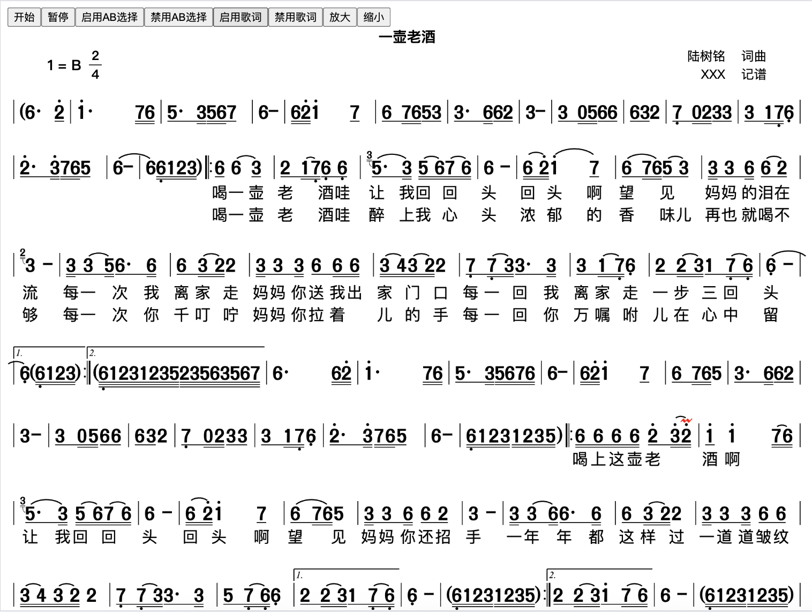
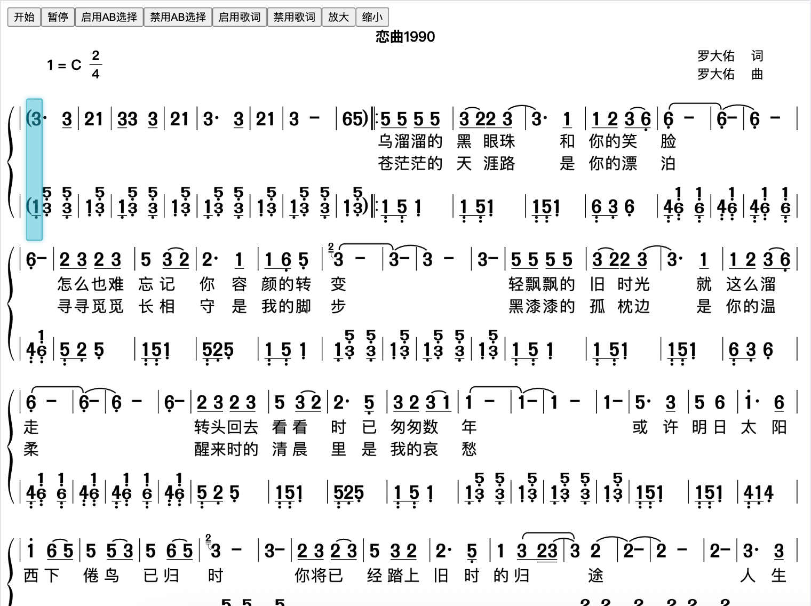

# 八戒简谱

面向在线乐谱、音乐教学、简谱排版与播放场景的多声部简谱渲染引擎。

支持 `JPW` / `番茄简谱` / `ABC` / `MusicXML` 格式文件解析，支持 `SVG` / `Canvas` 渲染、`SoundFont` 播放，并具备歌词、指法、和弦显示、批注、移调、实时变调、划拍线等能力，适合做在线曲谱预览、跟弹跟唱、课堂教学、作业练习、内容平台乐谱展示等应用。

如果你正在找一套可落地、可二次开发、可直接用于业务的简谱引擎，可以直接加微信联系源码购买。

## 这套源码适合谁

- 在线乐谱平台
- 音乐教学 SaaS / 小程序 / App
- 简谱编辑器、排版工具开发者
- 需要做课程配套乐谱展示与播放的团队
- 有简谱数字化、教学互动、曲谱播放需求的项目方

## 核心能力

- 多声部简谱渲染，适合合唱、合奏、钢琴弹唱、教学对位展示
- 支持 `JPW` / `番茄简谱` / `ABC` / `MusicXML` 解析导入
- 支持 `SVG` / `Canvas` 两套渲染输出方案，便于适配不同前端架构
- 支持 `SoundFont` 播放，可结合教学、跟唱、试听场景使用
- 支持歌词显示，适合声乐、弹唱、儿童音乐教学
- 支持指法、和弦显示，便于器乐教学和伴奏场景
- 支持批注能力，适合课堂讲解、重点标注、作业反馈
- 支持移调与实时变调，方便不同调式练习和教学演示
- 支持划拍线，增强节奏训练和课堂示范体验

## 适用场景

- 在线乐谱网站或乐谱内容平台
- 音乐培训机构的教学系统
- 钢琴、吉他、声乐等课程配套产品
- 简谱资源库、数字曲谱馆、内容付费平台
- 需要“解析 + 渲染 + 播放 + 教学辅助”一体化能力的项目

## 渲染效果示例

### 单声部渲染示例

### 多声部渲染示例

### 演示视频

[点击查看演示视频](./example/example.mp4)

## 为什么适合买源码

- 已经具备完整的简谱解析、渲染、播放与教学辅助能力，不是单一 Demo
- 功能点集中，适合直接集成到现有产品中
- 能显著缩短从需求到上线的研发周期
- 相比从零自研，可节省大量排版规则、播放联动、教学功能打磨成本

## 补充说明

如果你对小程序、App 内运行 Web 技术的性能表现有顾虑，也可以沟通定制为小程序原生版本或 App 原生版本，以适配更高性能、更深度集成的业务场景。

## 联系方式

对源码、授权方式、价格、二开合作感兴趣，可直接扫码添加微信沟通。

加微信时建议备注：

- 简谱源码购买
- 项目场景
- 预计使用端（Web / 小程序 / App）

有明确需求的团队，欢迎直接联系。
